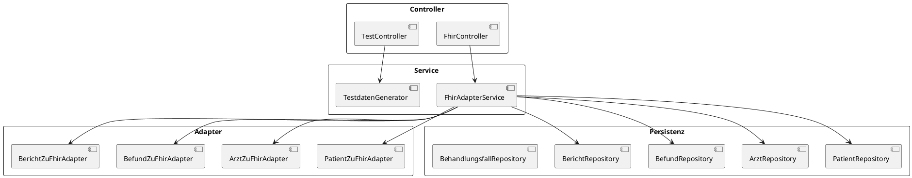

# LegacyToFHIR – Adapter zur Transformation relationaler Krankenhaussysteme in HL7 FHIR

## 1. Projektübersicht und Zielsetzung
Das Projekt **LegacyToFHIR** adressiert die Herausforderung, Daten aus proprietären, relationalen Krankenhaus-Informationssystemen in standardisierte HL7-FHIR-Ressourcen zu überführen. Ziel ist ein Adapter, der vorhandene Legacy-Datenbanken liest, die Inhalte mit Hilfe spezialisierter Adapter-Klassen in FHIR-R4-konforme JSON-Strukturen transformiert und über eine REST‑Schnittstelle bereitstellt. Dadurch werden Interoperabilität, sekundäre Datennutzung und der Anschluss an moderne Gesundheitsplattformen erleichtert.

## 2. Systemarchitektur und Komponenten
### 2.1 Architekturüberblick

Die Architektur folgt einem klassischen Schichtenmodell: Controller nehmen HTTP‑Anfragen entgegen, delegieren an Services, welche Repositories und Adapter zur Transformation nutzen. 

### 2.2 Zentrale Komponenten
* **FhirController** – stellt FHIR-konforme Endpunkte bereit, etwa `GET /fhir/Patient/{id}` oder `GET /fhir/Patient/{patientId}/Bundle`【F:src/main/java/de/gib/betrieb/controller/FhirController.java†L51-L146】
* **FhirAdapterService** – koordiniert die Konvertierung von Legacy-Entities in FHIR-Ressourcen und bündelt Patientendaten in FHIR-Bundles【F:src/main/java/de/gib/betrieb/service/FhirAdapterService.java†L21-L209】
* **PatientZuFhirAdapter**, **ArztZuFhirAdapter**, **BefundZuFhirAdapter**, **BerichtZuFhirAdapter** – transformieren Entitäten in FHIR `Patient`, `Practitioner`, `Observation` bzw. `DiagnosticReport`【F:src/main/java/de/gib/betrieb/adapter/PatientZuFhirAdapter.java†L24-L65】【F:src/main/java/de/gib/betrieb/adapter/ArztZuFhirAdapter.java†L23-L67】【F:src/main/java/de/gib/betrieb/adapter/BefundZuFhirAdapter.java†L31-L130】【F:src/main/java/de/gib/betrieb/adapter/BerichtZuFhirAdapter.java†L38-L148】
* **TestController** und **TestdatenGenerator** – erzeugen synthetische Legacy-Daten zur Demonstration und bieten Vergleichs- sowie Performance‑Tests des Adapters an【F:src/main/java/de/gib/betrieb/controller/TestController.java†L39-L210】【F:src/main/java/de/gib/betrieb/service/TestdatenGenerator.java†L80-L118】
* **Repositories** – JPA-Repositories zur Kapselung des Datenzugriffs auf Patienten, Ärzte, Befunde und Berichte【F:src/main/java/de/gib/betrieb/datenbank/PatientRepository.java†L10-L25】【F:src/main/java/de/gib/betrieb/datenbank/BefundRepository.java†L8-L13】

## 3. Verwendete Technologien und Bibliotheken
| Technologie/Bibliothek | Zweck |
| --- | --- |
| Spring Boot 3.5.3 | Anwendungskern und REST-Infrastruktur【F:pom.xml†L32-L36】 |
| Spring Data JPA | ORM für den Zugriff auf die relationale PostgreSQL-Datenbank【F:pom.xml†L38-L42】 |
| HAPI FHIR (Base & R4) | FHIR-Modell und Utility-Klassen zur Erstellung von R4‑Ressourcen【F:pom.xml†L44-L54】 |
| springdoc-openapi | automatische Generierung von OpenAPI/Swagger-Dokumentation【F:pom.xml†L57-L61】 |
| PostgreSQL JDBC | Datenbanktreiber zur Laufzeit【F:pom.xml†L63-L66】 |
| JUnit/Spring Boot Test | Grundlage für potentielle Unit-Tests【F:pom.xml†L68-L72】 |

Konfigurationsparameter für Datenbank und OpenAPI werden über `application.properties` verwaltet【F:src/main/resources/application.properties†L3-L18】.

## 4. Datenmodell und Transformation
### 4.1 Relationale Datenmodelle
Die Legacy-Datenbank modelliert zentrale klinische Entitäten als JPA-Entities. Beispielhaft seien `Patient`, `Behandlungsfall` und `Befund` genannt:
* **Patient** mit Namen, Geschlecht und Beziehungen zu Behandlungsfällen, Verordnungen und Terminen【F:src/main/java/de/gib/betrieb/model/krankenhaus/Patient.java†L8-L33】
* **Behandlungsfall** mit Referenzen zu Patient, Arzt und Standort sowie Listen von Befunden und Berichten【F:src/main/java/de/gib/betrieb/model/krankenhaus/Behandlungsfall.java†L17-L44】
* **Befund** als Messwert mit Code, Einheit und Zeitpunkt【F:src/main/java/de/gib/betrieb/model/krankenhaus/Befund.java†L7-L24】

### 4.2 FHIR-Transformation
Die Adapter konvertieren Entitäten in strukturierte JSON-Maps gemäß HL7 FHIR R4. Beispiel Patient:
```text
Legacy: Patient.vorname + nachname → FHIR.name[0].given/family
Legacy: geschlecht → FHIR.gender (male|female|other|unknown)
Legacy: patientenId → FHIR.identifier[0].value
```
Die Implementierung setzt u. a. folgende Schritte um:
* Generierung eines `Patient`-Identifiers und Abbildung des Geschlechts【F:src/main/java/de/gib/betrieb/adapter/PatientZuFhirAdapter.java†L35-L52】
* Kodierung von Befundkategorien (Labor, Vitalzeichen) und Messwerten【F:src/main/java/de/gib/betrieb/adapter/BefundZuFhirAdapter.java†L48-L71】【F:src/main/java/de/gib/betrieb/adapter/BefundZuFhirAdapter.java†L95-L120】
* Zusammenführung eines Patienten-Bundles inkl. Befunden und Berichten【F:src/main/java/de/gib/betrieb/service/FhirAdapterService.java†L171-L209】
Validierungen erfolgen implizit durch strikt typisierte FHIR-Felder (z. B. ISO‑8601‑Zeitformat) und können bei Bedarf mit HAPI-FHIR-Validatoren erweitert werden.

## 5. API-Dokumentation
Die REST-API ist in zwei Bereiche gegliedert:

### 5.1 Legacy- und Test-Endpunkte (`/api/test`)
| Methode & Pfad | Beschreibung |
| --- | --- |
| `POST /api/test/generiere/{anzahl}` | Erzeugt synthetische Testdaten【F:src/main/java/de/gib/betrieb/controller/TestController.java†L39-L52】 |
| `GET /api/test/fhir-test` | Führt Konvertierung eines Beispielpatienten durch und liefert Statistik【F:src/main/java/de/gib/betrieb/controller/TestController.java†L104-L123】 |
| `GET /api/test/performance-test/{anzahl}` | Misst die Konvertierungszeit für mehrere Patienten【F:src/main/java/de/gib/betrieb/controller/TestController.java†L173-L203】 |

### 5.2 FHIR-Endpunkte (`/fhir`)
| Methode & Pfad | Beschreibung |
| --- | --- |
| `GET /fhir/Patient` | Liste aller Patienten als FHIR-Ressourcen【F:src/main/java/de/gib/betrieb/controller/FhirController.java†L51-L54】 |
| `GET /fhir/Patient/{id}` | Einzelner Patient (FHIR `Patient`)【F:src/main/java/de/gib/betrieb/controller/FhirController.java†L56-L68】 |
| `GET /fhir/Practitioner/{id}` | Einzelner Arzt (FHIR `Practitioner`)【F:src/main/java/de/gib/betrieb/controller/FhirController.java†L78-L90】 |
| `GET /fhir/Patient/{id}/Observation` | Alle Befunde eines Patienten (FHIR `Observation`)【F:src/main/java/de/gib/betrieb/controller/FhirController.java†L106-L112】 |
| `GET /fhir/Patient/{id}/DiagnosticReport` | Alle Berichte eines Patienten (FHIR `DiagnosticReport`)【F:src/main/java/de/gib/betrieb/controller/FhirController.java†L128-L134】 |
| `GET /fhir/Patient/{id}/Bundle` | Komplettes Bundle mit Patient, Befunden und Berichten【F:src/main/java/de/gib/betrieb/controller/FhirController.java†L136-L146】 |
| `GET /fhir/stats` | Statistiken über verfügbare Ressourcen【F:src/main/java/de/gib/betrieb/controller/FhirController.java†L150-L156】 |

Swagger/OpenAPI-Dokumentation wird automatisch generiert und ist unter `http://localhost:8090/swagger-ui.html` erreichbar【F:src/main/java/de/gib/betrieb/config/SwaggerConfig.java†L1-L25】.

## 6. Installation, Setup und Konfiguration
1. **Voraussetzungen:** Java 17, Maven, PostgreSQL 14+
2. **Projekt bauen:** `mvn package`
3. **Datenbank konfigurieren:** In `application.properties` Benutzer, Passwort und URL anpassen【F:src/main/resources/application.properties†L3-L7】
4. **Datenbank-Schema/Testdaten:** Optionale SQL-Skripte `schema.sql` und `testdaten.sql` dienen als Vorlage für eigene Migrationen.
5. **Start:** `java -jar target/LegacyToFHIR-0.0.1-SNAPSHOT.jar` – Standardport 8090 (konfigurierbar in `application.properties`).
6. **Testdaten generieren:** `POST /api/test/generiere/50`

## 7. Betrieb, Nutzung und Test
* **Serverbetrieb:** Nach dem Start sind FHIR- und Test-Endpunkte über `http://localhost:8090/` erreichbar.
* **Vergleichstest:** `GET /api/test/vergleiche/{id}` vergleicht Legacy- gegen FHIR‑Darstellung eines Patienten.
* **Performance-Test:** `GET /api/test/performance-test/{anzahl}` misst Durchsatz in Patienten pro Sekunde.
* **API-Dokumentation:** Swagger UI bietet eine interaktive Testoberfläche.
* **Tests:** Ein Maven-Testlauf wurde versucht, scheiterte jedoch aufgrund fehlender Abhängigkeiten (Netzwerkzugriff)【9831f8†L1-L20】.

## 8. Sicherheit und Datenschutz
Die aktuelle Implementierung enthält keine Authentifizierung oder Autorisierung. Für produktive Nutzung sind folgende Maßnahmen erforderlich:
* Zugriffsschutz (z. B. OAuth2 oder JWT)
* Transportverschlüsselung via HTTPS
* Protokollierung und Audit-Trails
* DSGVO-konforme Datenverarbeitung und Pseudonymisierung

## 9. Grenzen, Limitationen und Ausblick
* Unterstützung nur für ausgewählte FHIR-Ressourcen (`Patient`, `Practitioner`, `Observation`, `DiagnosticReport`).
* Fehlende Validierung gegen vollständige FHIR-Profile; HAPI-FHIR könnte hierfür stärker genutzt werden.
* Keine Konfigurationsoberfläche für Mapping-Tabellen.
* Keine Sicherheitsmechanismen und nur rudimentäres Fehlermanagement.

**Ausblick:** Erweiterung um weitere Ressourcen (z. B. `Medication`, `Encounter`), Nutzung von FHIR-Profilen, Implementierung von Suchparametern, Integration eines robusten Test- und CI-Systems sowie cloudfähige Bereitstellung.

## 10. Wissenschaftlicher Kontext und Referenzen
* HL7 International: *FHIR Release 4 (R4)*, 2019. DOI: 10.1007/978-3-540-88470-3
* SNOMED International: *SNOMED CT* Terminology, 2024.
* Europäische Union: *Datenschutz-Grundverordnung (DSGVO)*, Verordnung (EU) 2016/679.
* OpenAPI Initiative: *OpenAPI Specification v3.1*, 2021.

---
© 2025 – Dieses Projekt dient als Demonstrator im Rahmen einer wissenschaftlichen Auseinandersetzung mit Interoperabilität im Gesundheitswesen.
